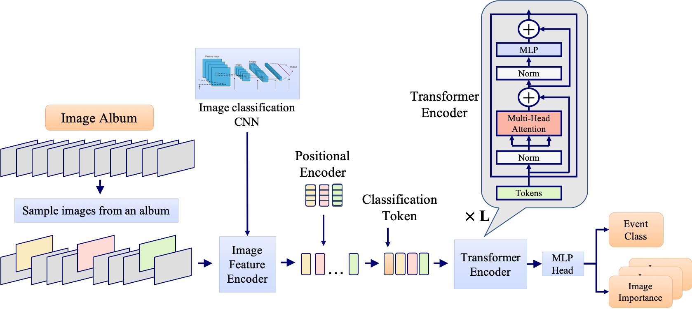

# PETA: Photo Albums Event Recognition using Transformers Attention

[Paper](https://arxiv.org/abs/2109.12499) |  [Pretrained models](https://miil-public-eu.oss-eu-central-1.aliyuncs.com/model-zoo/PETA/peta_32.pth)

Official PyTorch Implementation

> Tamar Glaser, Emanuel Ben Baruch, Gilad Sharir, Nadav Zamir, Asaf Noy, Lihi Zelnik-Manor<br/> DAMO Academy, Alibaba
> Group

**Abstract**

In recent years the amounts of personal photos captured increased significantly, giving rise to new challenges in 
multi-image understanding and high-level image understanding. Event recognition in personal photo albums presents one 
challenging scenario where life events are recognized from a disordered collection of images, including both relevant 
and irrelevant images. Event recognition in images also presents the challenge of high-level image understanding, 
as opposed to low-level image object classification.
In absence of methods to analyze multiple inputs, previous methods adopted temporal mechanisms, including various forms
 of recurrent neural networks. 
However, their effective temporal window is local. In addition, they are not a natural choice given the disordered 
characteristic of photo albums. We address this gap with a tailor-made solution, combining the power of CNNs for image 
representation and transformers for album representation to perform global reasoning on image collection, offering a 
practical and efficient solution for photo albums event recognition. Our solution reaches state-of-the-art results on 3 
prominent benchmarks, achieving above 90% mAP on all datasets. We further explore the related image-importance task in 
event recognition, demonstrating how the learned attentions correlate with the human-annotated importance for this 
subjective task, thus opening the door for new applications.
#




## Photo albums Event Recognition using Transformers Attention (PETA) Implementation
An implementation of our model for photo albumm event recognition using transformers is found [here](https://github.com/Alibaba-MIIL/PETA/blob/main/src/models/aggregate/layers/transformer_aggregate.py).
- ```class TAggregate(nn.Module)```

## Pretrained Models
We provide a pre-trained model on ML-CUFED dataset, which can be found [here](https://miil-public-eu.oss-eu-central-1.aliyuncs.com/model-zoo/PETA/peta_32.pth)

## Inference Code (Demo)
We provide an [inference code](infer.py), that demonstrates how to load our model, pre-process some sample albums do actual inference. Example run:

```
python infer.py  \
--model_path=./models_local/peta_32.pth \
--model_name=mtresnetaggregate \
--album_path albums/Personal_sports/44_65592177@N00 \
--threshold=0.9 \
```

### Result Examples
<p align="center">
 <table class="tg">
  <tr>
    <td class="tg-c3ow"></td>
  </tr>
</table>
</p>
<p align="center">
 <table class="tg">
  <tr>
    <td class="tg-c3ow"></td>
  </tr>
</table>
</p>

<!--
### Training Code
We provide a [training code](train.py), that can be used to train our model. 
- The implementation in the provided training script is based on the [ASL repository](https://github.com/Alibaba-MIIL/ASL).
- The annotations should be provided in COCO format.
- To reproduce similar results to our paper results on COCO use the split provided in: [Zero-Shot Object Detection](https://ankanbansal.com/zsd.html).
- The annotation files are expected to be in the metadata path under "zs_split" folder.
- wordvec_array.pickle and cls_ids.pickle include coco word-vectors and seen-uneen class ids respectively, and should be located in the metadata path.
- The pretrained imagenet based backbone can be downloaded [here](https://miil-public-eu.oss-eu-central-1.aliyuncs.com/model-zoo/PETA/peta_32.pth
)
- Run the following training args:
```
python train.py  \
--data=./data/COCO/ \
--model-path=./models/tresnet_m.pth \
--image-size=608 \
--pretrain-backbone=1 \
```

Note: the resolution is higher as we compared to object detection based methods that use similar or larger input size.
-->

## Citation
```
@article{Glaser22PETA,
  author    = {Tamar Glaser and
               Emanuel Ben Baruch and               
               Gilad Sharir and
               Nadav Zamir and
               Asaf Noy and
               Lihi Zelnik{-}Manor},
  title     = {PETA: Photo Albums Event Recognition using Transformers Attention},
  year      = {2022},
  url       = {https://arxiv.org/},
  archivePrefix = {arXiv},
  eprint    = {},
  timestamp = {Wed, 18 Aug 2021 19:52:30 +0200}
}
```
<!-- ## Contact
Feel free to contact if there are any questions or issues - Tamar Glaser (tamar.glaser@alibaba-inc.com) or Emanuel
Ben-Baruch (emanuel.benbaruch@alibaba-inc.com) or Gilad Sharir (gilad.sharir@alibaba-inc.com) -->

## Acknowledgements
Several albums from ML-CUFED dataset ([link](https://arxiv.org/abs/1707.05911)) are used in this project. Some components of this code implementation are adapted from the repository https://github.com/Alibaba-MIIL/ASL.
